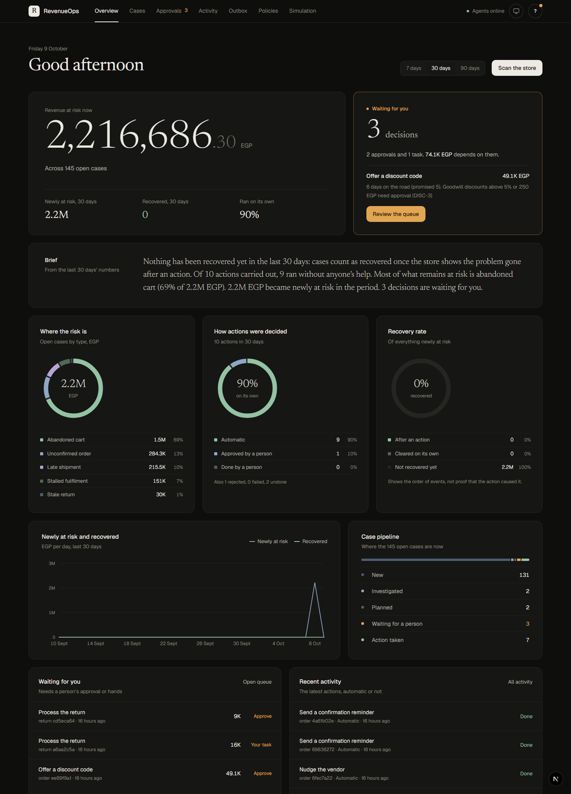
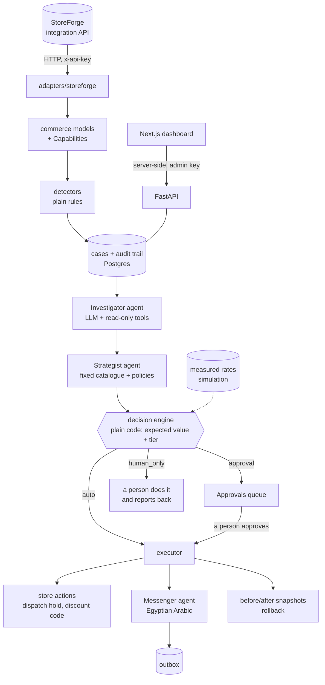
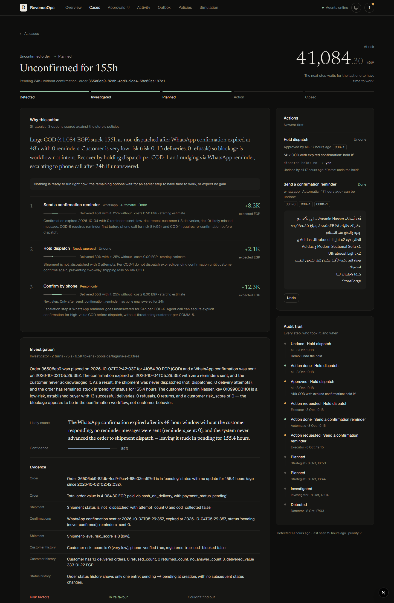
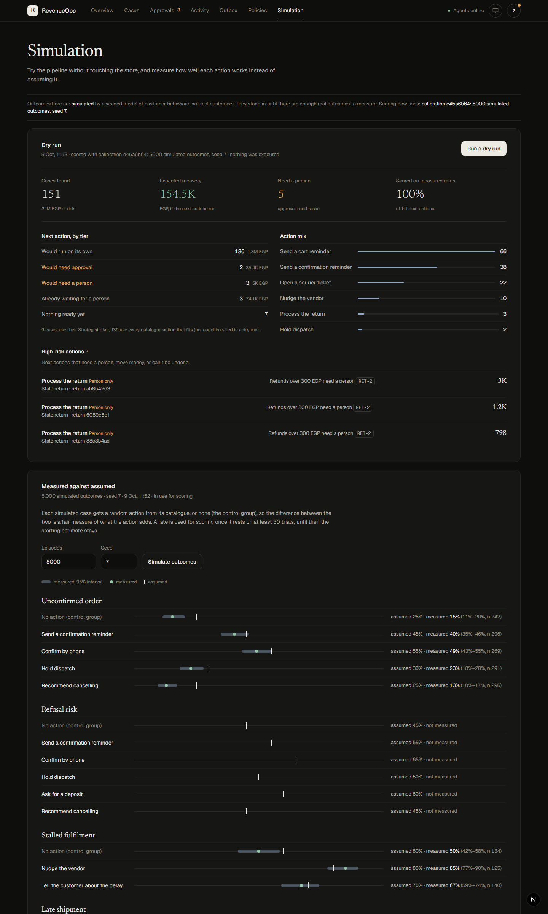
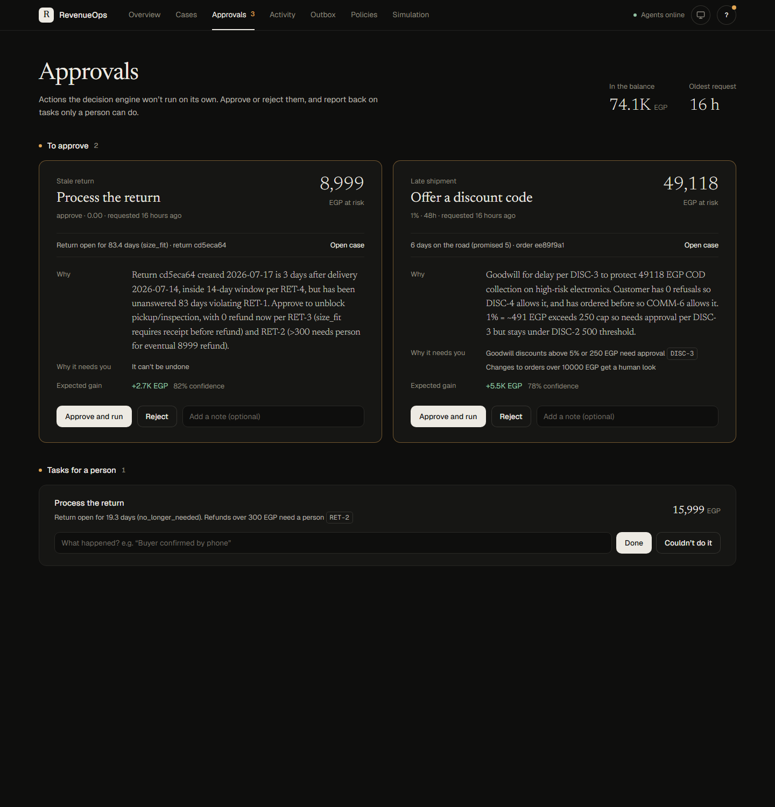
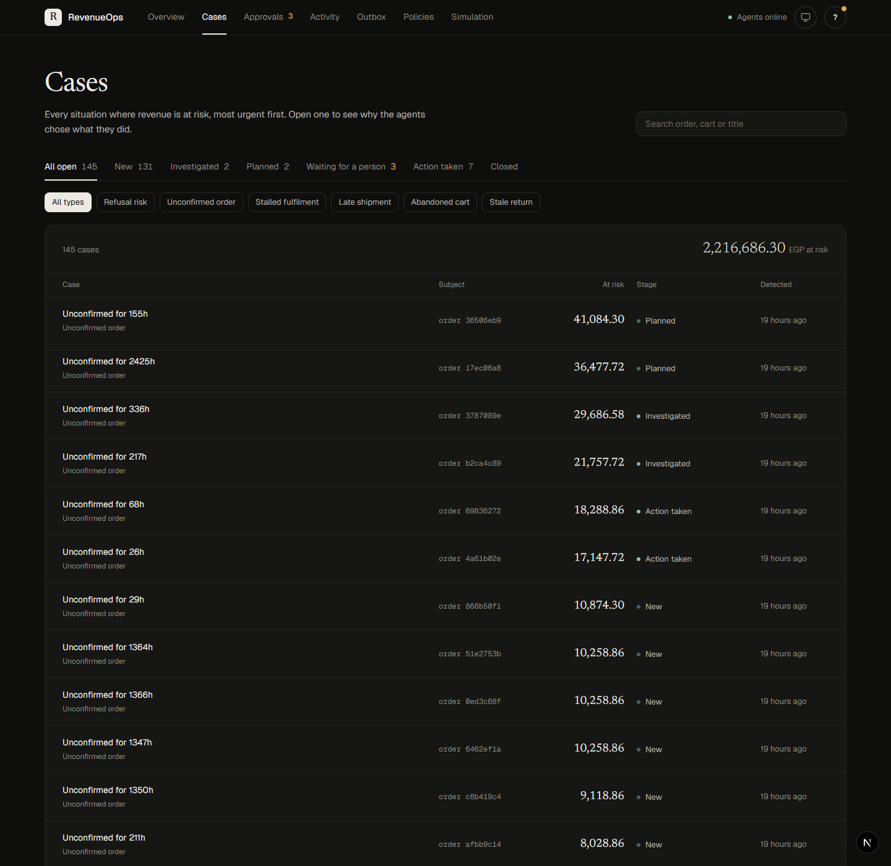

# RevenueOps Autopilot

AI agents that find revenue at risk in an e-commerce store, decide the safest
action with the most value, act on low-risk cases automatically, and send risky
ones to a human — with every decision recorded and reversible.

The first target is cash-on-delivery commerce in Egypt, where orders are lost to
customers who refuse at the door, orders nobody confirms, shipments that stall,
and carts that are abandoned. The first store is
[StoreForge](https://github.com/Ali-mohamed843/ecommerce-saas); the design is
platform-agnostic, with one adapter per store.

> Status: Phase 7 — the full loop runs from a dashboard (detect, investigate,
> plan, act, approve, audit, undo), a dry run shows what would happen without
> doing it, a seeded outcome simulation measures each action's success rate, and
> 40 labelled scenarios check the decisions: **no case that needed a person ran
> on its own**. **Outcomes are simulated, not real.**



## How it fits together



The design rule: the language model investigates and proposes; deterministic
code decides what may run automatically. The model never approves money or
irreversible actions on its own.

**Platform-agnostic.** Only `adapters/` knows about a specific store. Everything
else works with `commerce/models.py`, and each adapter declares its
`Capabilities`; a detector that needs a feature the store lacks is skipped.
`lint-imports` enforces this in CI, and every adapter must pass the shared
contract in `tests/contract.py`.

### Case types

| Case | Detected when | Priority |
|---|---|---|
| `refusal_risk` | unshipped COD order the store scores ≥ 55/100 for refusal | 1 |
| `unconfirmed_order` | pending for 24 h or more | 2 |
| `stalled_fulfilment` | confirmed or processing for 48 h, not shipped | 3 |
| `late_shipment` | on the road past the courier's promised days | 3 |
| `abandoned_cart` | idle 24 h – 30 days, customer reachable | 4 |
| `stale_return` | return request untouched for 48 h | 4 |

A subject (order, cart, return) has at most one open case; the most urgent rule
wins. Re-running detection updates cases and closes those whose condition
cleared.

### How actions are decided

The Strategist picks 1–4 actions from a fixed catalogue (`decision/catalogue.py`)
and cites the policy rules it relied on (`policies/*.md`). Proposals naming an
unknown action, a parameter out of range or a rule that doesn't exist are sent
back to it. Then plain code takes over (`decision/score.py`):

- **Expected value** = (P(recovered with the action) − P(recovered without)) ×
  value at risk − expected cost. The probabilities start as hand-set estimates
  in `decision/priors.py` and are replaced by measured rates once a calibration
  is active (see *Simulation and measured outcomes*). The model never sets them.
- **Tier:** `auto` (harmless if wrong, or undoable, and within every limit),
  `approval`, or `human_only`. The most important policy limits are written in
  code as well — refunds over 300 EGP always need a person, discounts above 10%
  or 500 EGP need approval — so no prompt or policy edit can loosen them. Every
  tier comes with its reasons and the rule each one enforces.

- **Escalation steps** (`decision/escalation.py`): some actions only make sense
  after a cheaper one has failed. For an unconfirmed order the phone call waits
  until a reminder has gone unanswered for 24 hours, and cancellation until the
  call has failed (COD-4, COD-6). Actions that are ready now rank first, and
  only a ready action can be recommended; later steps are kept as the plan's
  next moves. On paper the call is worth more than the reminder, but the
  reminder costs almost nothing and often solves the problem alone.

The decision engine imports nothing from the model, database or store
(`lint-imports` enforces it), and CI requires 100% branch coverage for it.

### How actions are carried out

`revenueops act` takes each planned case's next ready action and scores it
again at that moment:

- **auto** runs at once: a message goes to the outbox, or the store changes
  (dispatch hold, discount code).
- **approval** waits in the queue until someone approves it. Approval scores it
  again and refuses anything that now needs a person, or whose case closed in
  the meantime.
- **human_only** (a phone call, a cancellation) is never done by the service; a
  person does it and reports back with `complete`.

Each proposed action runs at most once (a unique key in the database). Every
execution keeps before/after snapshots, who decided and when, and its result;
every step is also an event on the case and a note in the store's admin panel.
Rollback reverses the store side (releases the hold, voids an unused code) and
cancels unsent messages; return decisions and anything a person did can't be
undone.

Customer messages are drafted by the **Messenger** agent in Egyptian Arabic.
Code chooses the recipient from the store's records and checks the phone
number; the draft must contain its facts (order reference, discount code) and
may not mention risk or refusals (COMM-5). In this version messages stop in the
outbox — nothing is actually sent.

Policy retrieval is just "every policy tagged with this case type". With five
short documents that is exact and complete; a vector store would only add a way
to miss a rule.

## Simulation and measured outcomes

The decision engine needs to know how often each action works. It starts from
hand-set estimates (`decision/priors.py`); Phase 6 measures them instead.

- **Dry run** (`revenueops simulate dry-run`): detection reads the store, every
  case is scored exactly as the executor would, and a recorder takes the
  executor's place. The report gives the cases found, the action mix, what
  would run alone vs need a person, the expected recovery, and the high-risk
  actions. Nothing is executed and no model is called.
- **Outcomes** (`revenueops simulate outcomes --episodes 5000 --seed 7`): a
  seeded model of customer behaviour (`simulation/world.py`) stands in for real
  customers. Its probabilities differ from the starting estimates on purpose and
  depend on the segment (COD risk × order size); the scorer never sees them.
  Each simulated case gets a random action, or none as the control group, so
  the measured uplift is unbiased. Rates come with 95% Wilson intervals; over
  40 seeds the intervals covered the hidden truth 93.9% of the time.
- **Calibrate** (`revenueops simulate calibrate`): freezes those rates as what
  the scorer uses. A measured rate replaces an estimate only with ≥ 30 trials,
  and only as a with/without pair; every score records whether its chances were
  measured or assumed, and each plan records which calibration it used.

On the demo data, measuring changed real numbers: unconfirmed orders recover on
their own far less often than assumed (15% vs 25%), recommending cancellation
adds nothing over doing nothing, and a goodwill discount on late shipments works
worse than assumed (73% vs 82%). **These are simulated outcomes**; they stand in
until there are enough real ones.

## Evals

Forty labelled scenarios (`agent-service/src/revenueops/evals/scenarios.json`)
cover every case type: a case after investigation (its value, signals, the
investigator's report, what was already done) and the next actions a careful
operator would accept, each with the oversight it must get. "Wait" can be the
right answer. The score is the action the executor would really take next.

`revenueops eval` reports:

- **Decision accuracy:** the right action with the right oversight.
- **False-auto:** a case where a person was needed but the next action would
  have run on its own. It must be 0; the command exits with an error otherwise.
- **Cost and time** per case, from the model's token counts.

| Mode | What proposes | Accuracy | False-auto | Cost per case |
|---|---|---|---|---|
| `catalogue` (offline, in CI) | every catalogue action; the engine alone picks | 97.5% (39/40) | **0** | $0 |
| `llm` (`glm-5.3` via CodeCraft) | the real Strategist | 25/25 before the provider went down (502) | **0** | about $0.01 |

Full report: [docs/evals.md](docs/evals.md). The one miss, A6, is a known gap:
a customer who refused a delivery last month should get no discount (DISC-4),
but the store doesn't record refusal dates, so only the Strategist, reading the
policy, enforces it; the engine alone would offer the code. The live run will be
completed and published as `docs/evals-llm.md`:

```bash
uv run revenueops eval --mode llm --out ../docs/evals-llm.md
```

## Known limits

- **Outcomes are simulated.** Measured rates come from a seeded model of customer
  behaviour, not from real customers.
- **Nothing is sent.** Messages stop in the outbox.
- **One store so far.** The Shopify adapter (Phase 8) is the test of the
  platform-agnostic claim.
- **DISC-4 depends on the model** (see A6 above).
- **No MCP server yet**: the tools are only used by the service's own agents.
- The operator name is for the audit trail, not authentication; run the
  dashboard locally.

## The dashboard

`dashboard/` is a Next.js 15 app over the agent service API:

- **Overview** — revenue at risk, what's waiting for you, a brief from the
  numbers, and charts: where the risk is by case type, how actions were decided,
  the recovery rate, newly at risk vs recovered per day, and the case pipeline.
  A date range scopes everything.
- **Cases** — filter by stage and type; each case page answers *why this
  action?*: the Strategist's read, the next action with its expected gain and
  recovery chances, why it may run alone or needs a person (with the policy
  rules), the rest of the plan with escalation steps, the investigation's
  evidence, every action taken, and the audit trail. Buttons run the next
  pipeline step.
- **Approvals** — approve or reject queued actions; report back on tasks only
  a person can do.
- **Activity** — every action, with undo. **Outbox** — drafted messages,
  Arabic shown right-to-left. **Policies** — every rule, linkable.
  **Simulation** — run a dry run, simulate outcomes, compare measured against
  assumed, and switch scoring to the measured rates.

The look comes from a Claude Design canvas ("RevenueOps 2060"): warm neutrals,
Newsreader for headings and figures, Geist for the interface, IBM Plex Sans
Arabic for Arabic messages (all self-hosted through `next/font`), light and
dark themes. Status is never colour alone (each colour comes with its label),
chart legends carry the exact values, and the line chart has a screen-reader
table. The Overview's brief is written by code from the page's own numbers, not
by a model. The browser never talks to the agent service: pages render on the
dashboard's server and actions go through server actions, so the admin key
stays on the server. Decisions are recorded under the name you set with the
round button at the top right (a name for the audit trail, not authentication;
run it locally).

| | |
|---|---|
|  |  |
| *A case page: the Strategist's read, each option's expected gain and oversight, the Arabic reminder, the audit trail* | *Simulation: a dry run, measured vs assumed success rates* |
|  |  |
| *Approvals: what waits for a person* | *Cases, filtered by stage and type* |

## Run it locally

Requirements: [uv](https://docs.astral.sh/uv/), Docker, and StoreForge running
with `INTEGRATION_API_KEY` set in its `.env` and its migrations applied
(`npm run migration:run`; Phase 4 adds the dispatch hold).

```bash
docker compose up -d postgres
cd agent-service
cp .env.example .env      # then fill in STOREFORGE_API_KEY and a model key
uv sync
uv run alembic upgrade head
uv run revenueops detect
uv run revenueops investigate --limit 3
uv run revenueops plan --limit 3
uv run revenueops act
uv run revenueops queue
uv run uvicorn revenueops.main:app --reload --port 8000
```

Then the dashboard, in another terminal:

```bash
cd dashboard
cp .env.local.example .env.local   # set ADMIN_API_KEY to the agent service's
npm install
npm run dev -- --port 3001
```

Open http://localhost:3001 (port 3000 is StoreForge).

- `revenueops detect` scans the store and opens, updates or closes cases.
- `revenueops investigate` runs the Investigator on the most urgent open cases
  (`--case <id>` for one).
- `revenueops plan` runs the Strategist on investigated cases and scores its
  proposals.
- `revenueops act` runs or queues each planned case's next action;
  `revenueops queue` lists what waits for a person; `approve`, `reject`,
  `complete` and `rollback` take an execution id and `--by <your name>`.
- The API adds `GET /executions`, `GET /outbox`, and
  `POST /executions/{id}/approve|reject|complete|rollback` (header
  `X-Admin-Key: $ADMIN_API_KEY`).
- The API serves `GET /health`, `GET /cases` and `GET /cases/{id}`; docs at
  http://localhost:8000/docs.

### The model

Same setup as claude-agent-cli:
set `ANTHROPIC_API_KEY` for Claude, or `ANTHROPIC_BASE_URL=https://openrouter.ai/api`
plus `ANTHROPIC_AUTH_TOKEN` for OpenRouter, and `AGENT_MODEL`. Claude models get
adaptive thinking; other models get only the core Messages API fields.

For an OpenAI-compatible API instead (for example CodeCraft), set
`LLM_PROVIDER=openai`, `OPENAI_BASE_URL` and `OPENAI_API_KEY`; the service
translates its tool calls to the chat-completions format.

Demo data lives on the StoreForge side: `npm run seed:demo` there creates about
1,700 COD orders with realistic delivery histories and open cases.

## Checks

```bash
cd agent-service
uv run ruff format --check .
uv run ruff check .
uv run mypy
uv run lint-imports
uv run pytest
uv run revenueops eval --mode catalogue   # the 40 scenarios, offline; exits 1 on any false-auto
```

CI runs the same checks on Ubuntu and Windows, and lints, type-checks, tests
and builds the dashboard (`npm run lint`, `typecheck`, `test`, `build`). Tests need no network or API
key: the StoreForge adapter is tested against recorded real responses
(`tests/fixtures/storeforge`, re-record with `record.py` there), and the agents
against a scripted model.

## Layout

```
agent-service/
  src/revenueops/
    commerce/       generic store models and capabilities
    adapters/       base.py (the contract), registry.py, storeforge/
    detectors/      the case rules
    cases/          case and audit-event tables, idempotent sync
    agents/         LLM clients, tool loop, Investigator, Strategist
    decision/       action catalogue, starting priors, scorer (pure code)
    executor/       handlers per action, the executor, executions and outbox tables
    simulation/     dry run, the simulated world, outcomes and calibration
    evals/          40 labelled scenarios and the eval runner
    policies/       the store's rules as markdown
    pipeline.py     detect, then investigate
    cli.py, main.py command line and HTTP API
  migrations/       Alembic
  tests/
dashboard/          Next.js 15 + Tailwind 4 dashboard (port 3001)
docs/               eval report, demo script, screenshots
docker-compose.yml  local Postgres on port 5433
```
